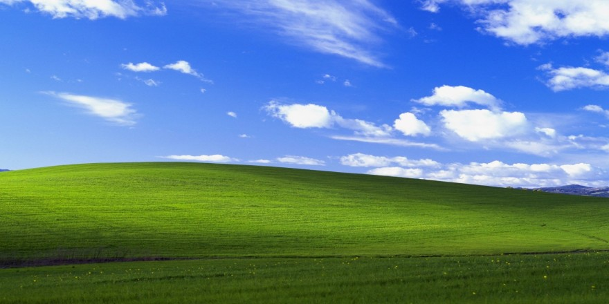

# I miss the old internet...

We went from personal websites, blogs and forums to centralized platforms, algorithms, ads and corporations.

I miss the old internet...

As a kid I was amazed by the internet. I could talk to people from all over the world, learn new things, play games, watch videos, listen to music, do so many things. It was magical.

Now it's all about private platforms with the only goal of making money by keeping you scrolling endlessly.

But its not all lost! We are seeing the rise of this idea of "indie web" where people are creating their own websites and blogs again. Its a small movement but its growing.

I think its important to have a place online that you own. A place where you can share your thoughts and ideas without worrying about algorithms or corporations.

Thats why I created this website. A place where I can share my thoughts and ideas with the world. A place where I can be myself.
